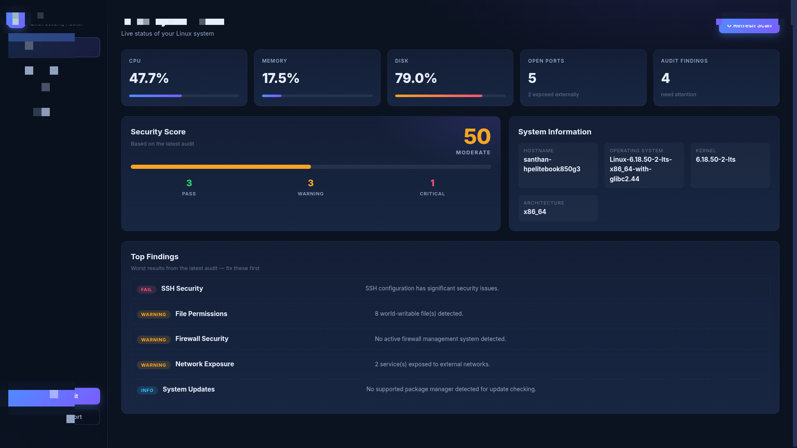
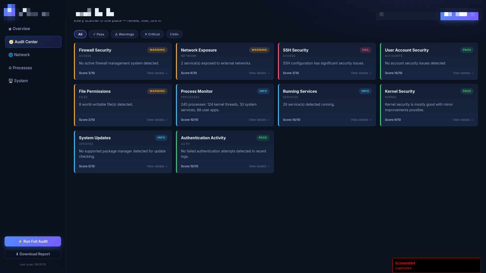
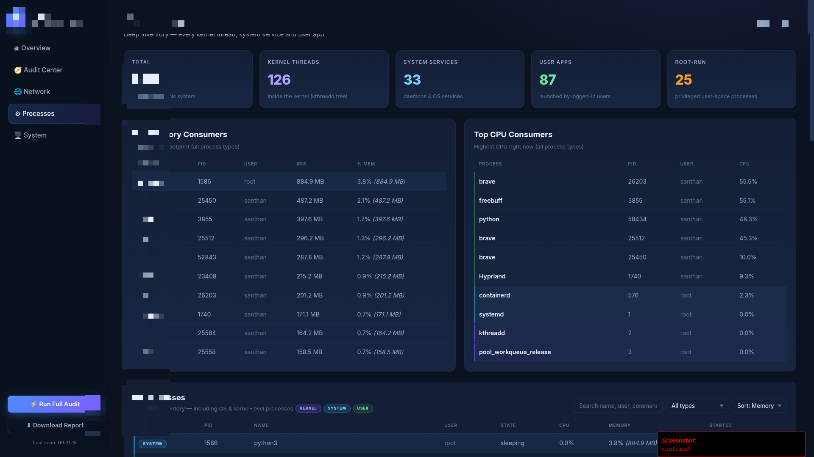
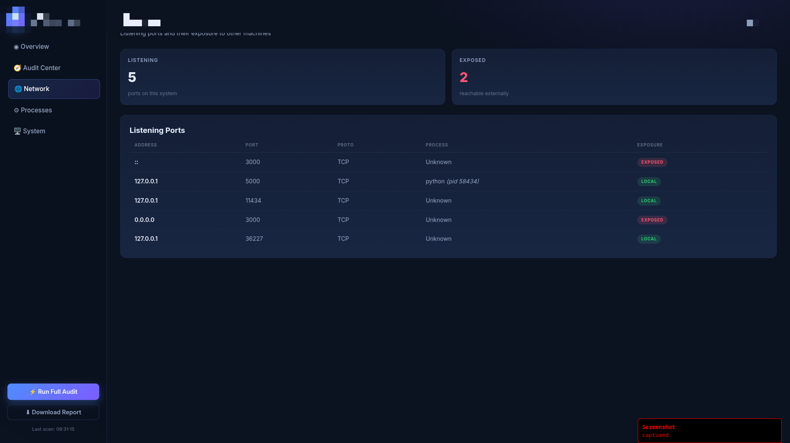
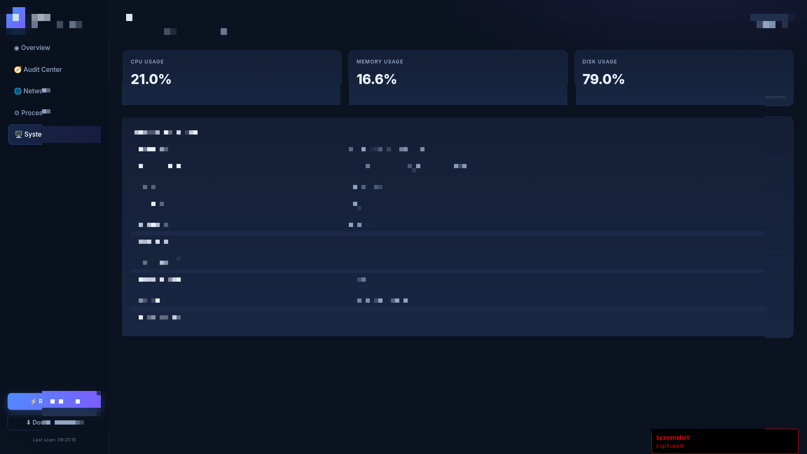

# 🛡️ Linux Security Auditor (LSA)

**Audit your Linux system from the terminal or a beautiful web dashboard — one command.**

```bash
lsa run
```

That's it: a security dashboard opens in your browser and your system gets scanned in real time.

---

## ✨ Features

- **One-command audit** — `lsa run` starts the dashboard and opens your browser; `lsa scan` audits in the terminal
- **10 security scanners** — firewall, network exposure, SSH config, user accounts, file permissions, processes, running services, kernel hardening, package updates, authentication logs
- **Complete process inventory** — the standout feature: sees **kernel threads** (`kthreadd` tree), **system services** and **user apps**, all color-highlighted
- **Security score 0–100** with rating and PASS / WARNING / CRITICAL breakdown
- **Every check explains itself** — what was found, *why it matters*, and the exact fix command
- **Filterable Audit Center** — search, filter by status, drill into any check
- **Deep process table** — search / sort / filter hundreds of processes, with RSS, state, threads, start time
- **Downloadable JSON report** — from the dashboard or `lsa scan --save report.json`
- **Zero config** — pure Python + psutil + Flask, no external services

## 📦 Install

> Requires **Linux** and Python **3.9+**

**Recommended (isolated):**
```bash
pipx install git+https://github.com/YOUR_USERNAME/linux-security-auditor.git
```

**Or with pip:**
```bash
pip install git+https://github.com/YOUR_USERNAME/linux-security-auditor.git
```

**From a clone (editable dev mode):**
```bash
git clone https://github.com/YOUR_USERNAME/linux-security-auditor.git
cd linux-security-auditor
pip install -e .
```

## 🖼 Screenshots

*Real screenshots from today's run (Sep 14, 2026)*

### Dashboard Overview



### Audit Center



### Process Inventory



### Network & Ports



### System Information



## 🚀 Usage

```text
lsa run                       Start the dashboard and open it in your browser
lsa run --port 8080           Use a specific port
lsa run --no-browser          Don't auto-open the browser
lsa scan                      Full audit in the terminal (pretty output)
lsa scan --json               Raw JSON report to stdout
lsa scan --save report.json   Save the JSON report to a file
lsa --version                 Show version
```

Bare `lsa` behaves like `lsa run`.

### Example `lsa scan` output

```text
  🛡️  Linux Security Auditor — full audit
  Host: mypc   Date: 2026-09-14 10:42

  ✓ PASS     User Account Security 10/10
      No account security issues detected.
  ▲ WARNING  Firewall Security 3/10
      No active firewall management system detected.
      → Consider installing and configuring a firewall (ufw, firewalld, or iptables/nftables)
  ✗ FAIL     SSH Security 3/10
      SSH configuration has significant security issues.
      → Review SSH configuration and consider: Set PermitRootLogin to 'no' ...
  ...

  ═══ Security Score ═══
  50/100  MODERATE
  ███████████████░░░░░░░░░░░░░░░
  ✓ PASS 3   ▲ WARNING 3   ✗ CRITICAL 1

  Fix these first:
    → SSH Security
    → File Permissions
    → Firewall Security
```

## 🖥 Dashboard tour

| View | What you get |
|---|---|
| **Overview** | Live CPU / memory / disk meters, open-ports card, security score gauge, top findings |
| **Audit Center** | All 10 checks as cards with scores, categories, status filters and search |
| **Network** | Every listening port with LOCAL / EXPOSED / NETWORK exposure badges |
| **Processes** | The deep inventory: KERNEL 🟣 / SYSTEM 🔵 / USER 🟢 badges, top memory & CPU, full searchable table |
| **System** | Hardware, OS, kernel, uptime details |

## 🔍 How the checks work

Each scanner runs local, read-only commands (`ufw status`, `sshd_config` parsing, `psutil` enumeration, log reads…) and returns a normalized result: **status, score, summary, why it matters, recommendation and collected evidence**. Nothing is sent anywhere — everything runs and stays on your machine.

> 💡 **Tip:** run with `sudo` for the deepest visibility — more SSH directives, log files and system paths can be read as root.

## 🗂 Project structure

```
app/
├── __init__.py        # Flask app factory
├── routes.py          # Dashboard + JSON API endpoints
├── cli.py             # lsa run / lsa scan command line
├── templates/         # Dashboard UI
├── static/            # CSS + JS
└── scanner/           # 10 security scanners + scoring
```

## 🤝 Contributing

PRs are welcome! Ideas that would fit nicely:

- more scanners (Docker, cron, sudoers, SUID binaries…)
- PDF/HTML report export
- score history graphs
- remediation scripts

1. Fork it
2. Create your feature branch: `git checkout -b feature/amazing-scanner`
3. Commit: `git commit -m "Add amazing scanner"`
4. Push and open a PR

## 📄 License

MIT — see [LICENSE](LICENSE).
